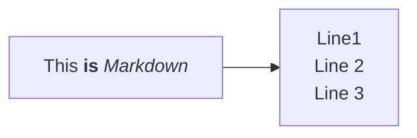
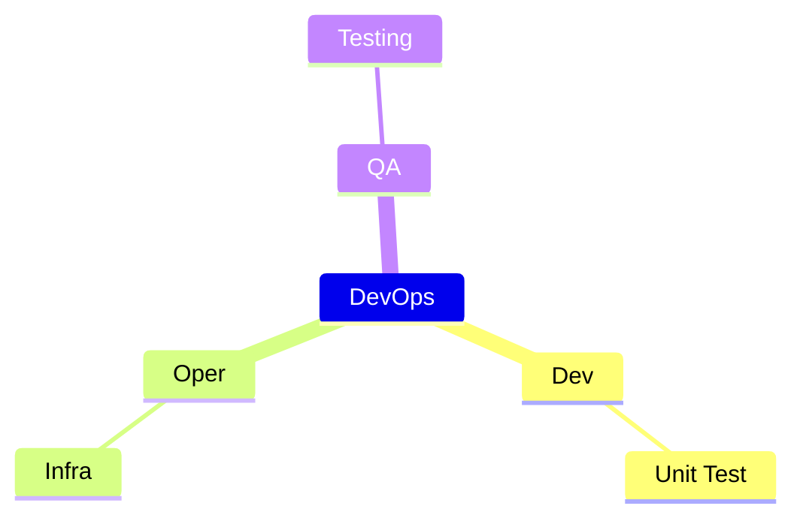
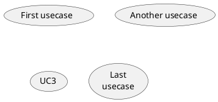

# Use case diagram
### flow chart

```mermaid
%%{init: {"flowchart": {"htmlLabels": false}} }%%
flowchart LR
    markdown["`This **is** _Markdown_`"]
    newLines["`Line1
    Line 2
    Line 3`"]
    markdown --> newLines
```
---
# mermaid mymap

```mermaid 
mindmap
    DevOps
        Dev
            Unit Test
        Oper
            Infra
        QA
            Testing
```
---
# planttml

```plantuml
@startuml

(First usecase)
(Another usecase) as (UC2)
usecase UC3
usecase (Last\nusecase) as UC4

@enduml
```

